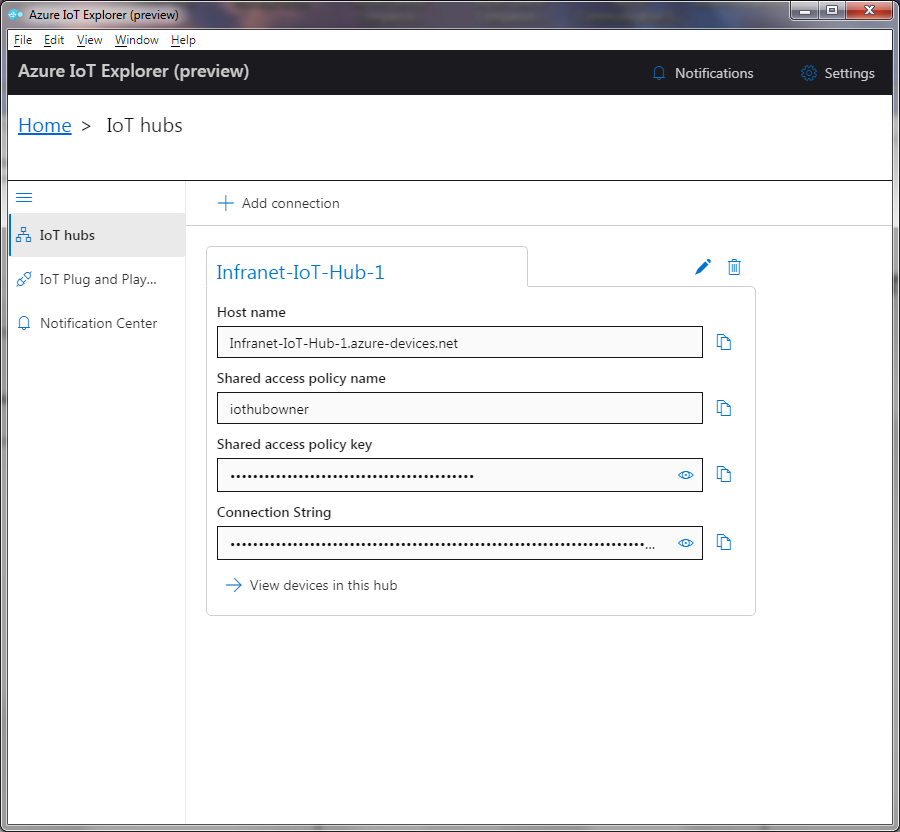
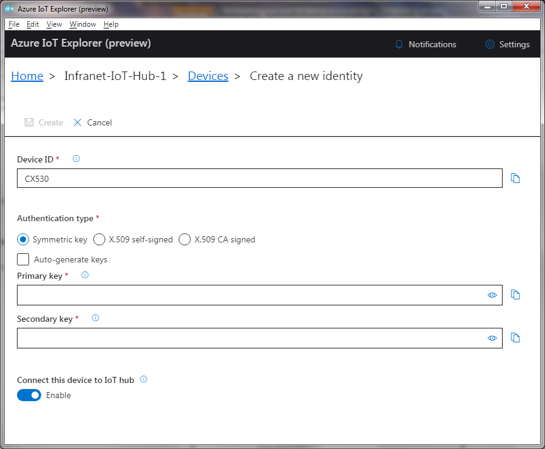
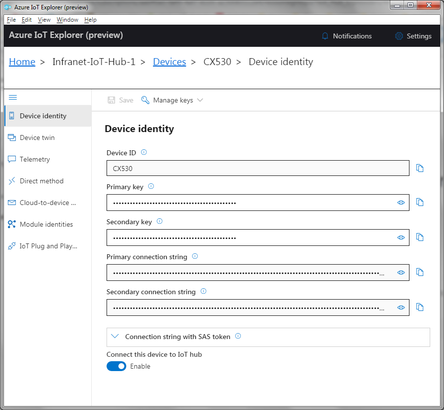
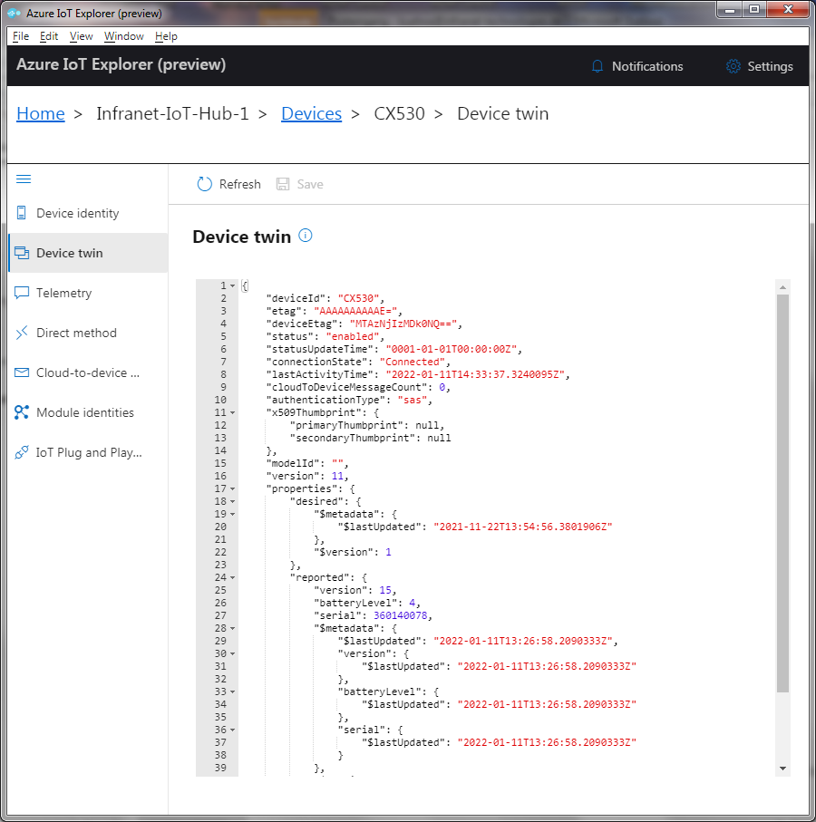
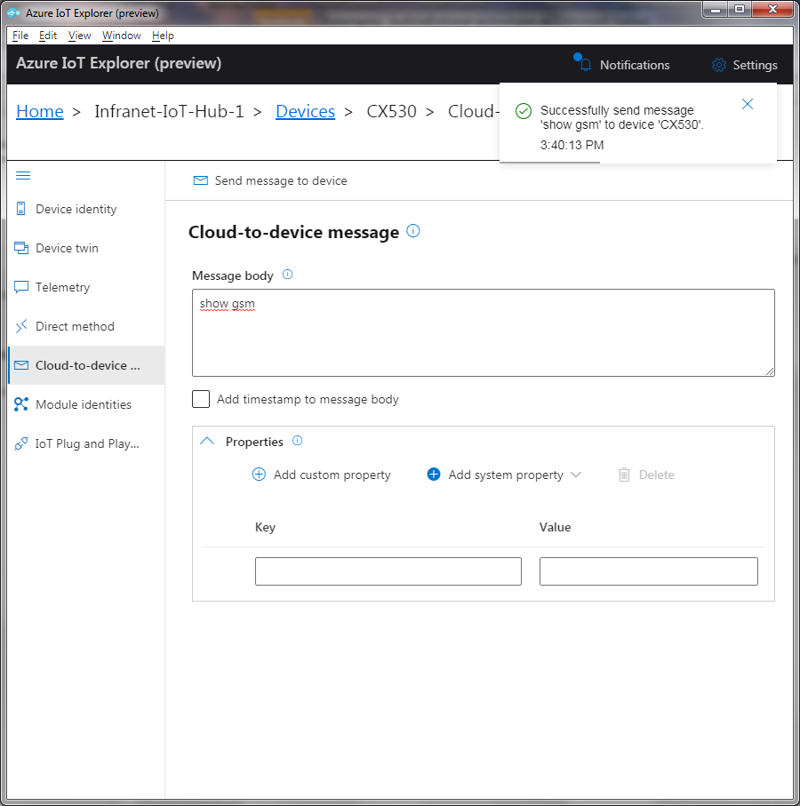
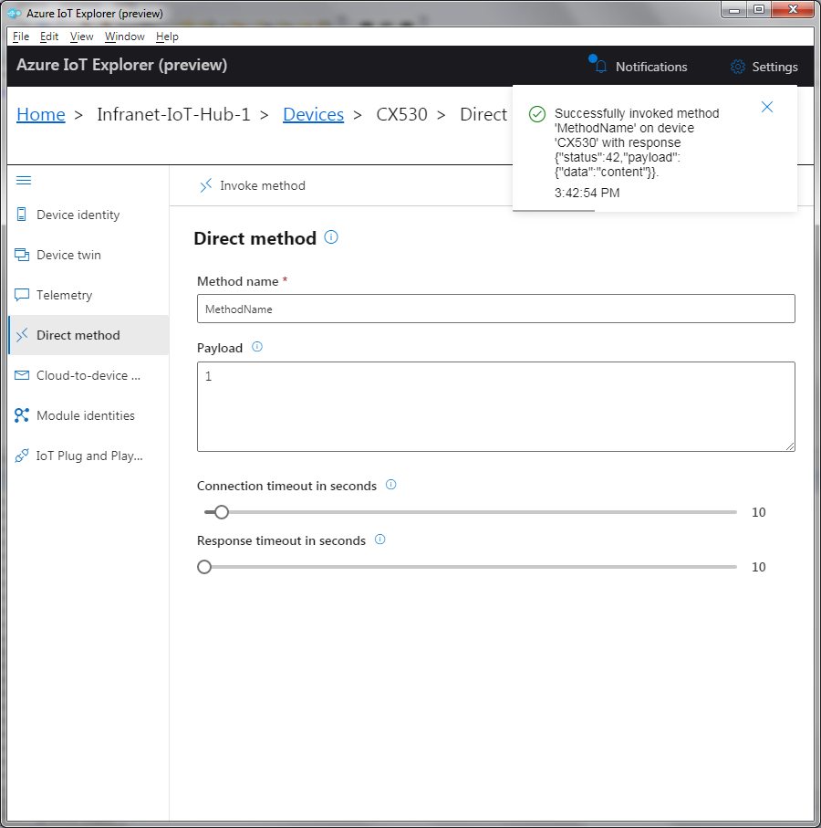

# Table of Contents

-   [Introduction](#Introduction)
-   [Step 1: Prerequisites](#Prerequisites)
-   [Step 2: Prepare your Device](#Prepareyourdevice)
-   [Step 3: Build, Run and Test](#Build)
-   [Step 4 : Additional Information](#AdditionalInformation)


<a name="Introduction"></a>
# Introduction
**About this document**
This document describes how to connect CX530 or CX510 device running NX32L Linux with Azure IoT SDK. This multi-step process includes:

-   Configuring Azure IoT Hub
-   Registering your IoT device
-   Provisioning your devices on Device Provisioning service 
-   Build and deploy Azure IoT SDK on device
-   Please provide introduction and features of your device here

<a name="Prerequisites"></a>
# Step 1: Prerequisites

You should have the following items ready before beginning the process:

-  [Create an Azure account](https://azure.microsoft.com/en-us/free/)
-  [Sign up to Azure Portal](https://portal.azure.com/#home)
-  [Setup your IoT hub](https://github.com/Azure/azure-iot-device-ecosystem/blob/master/setup_iothub.md)
-   M2M Control Integrated Development Environment (IDE)

- [Download the "azure_iot_hub" example and API](https://app.box.com/s/kek3qwsjzcx5owfq2i1spdwn8h21yv3i)

<a name="Prepareyourdevice"></a>
# Step 2: Prepare your Device
-    CX530 or CX510 Device with at least one initialzed communication interface (LTE, LAN, WiFi)
-    Connect to the CX530/CX510 via USB or M2M Control Communication Hub to the M2M Control IDE
-    Load the "azure_iot_hub" project with the M2M Control IDE

<a name="Build"></a>

# Step 3 : Build, Run and Test 

<a name="Step-3-1-Edit-Device-Information"></a>
## 3.1 Edit Device Provisioning Information

-    Fill in the Azure device provisioning information for the device in the source code:  

   ```
   iface : SINT   := 1;  // The network interface to use - 1 for Cellular
   
   server            : STRING := "<server name>";
   deviceId          : STRING := "<device ID>";
   
   // Certificate based authentication:
   cert              : STRING := "<certificate name>";
   cert_pass         : STRING := "<password for private key>";
   
   // Pregenerated SAS token
   SAS_token         : STRING := "<SAS token>";
   
   // Parameters for generating SAS Token locally: 
   // Base 64 encoded shared access key
   SharedAccessKey   : STRING := "<shared access key>";
   
   // Time difference between UTC and device time
   tz_offset         : INT    := 0; 
   
   // Number of seconds from when the token was created until it should expire.
   sas_lifetime      : DINT   := 86400; 
   
   // Authentication type:
   // TRUE:  use certificates
   // FALSE: use SAS tokens.
   use_certs         : BOOL   := FALSE; 
   
   // SAS tokens:
   // TRUE:  generate the SAS token from the shared access key.
   // FALSE: use the value from the SAS_token variable.
   use_sak           : BOOL   := TRUE; 
   ```

-    If you use a certificate, please download the certificate with the IDE (Menu: Device -> Configuration -> Certificates) 

     

<a name="Step-3-2-Compile-and-Rund"></a>
## 3.2 Run and Test

- Recompile and download

- The CX530 /CX510 should now connect to the Azure IoT hub. The device sends a Device-to-Cloud message every 30 seconds and a digital twin is supported.

- Check the Azure IoT hub for incomming messages and the digital twin.

- You also can send Cloud-To-Device message from the Azure IoT hub.

- Note: this configuration data does not have to be hard-coded. The configuration data can typically also be managed in permanent flash.

  
<a name="Integration with Azure IoT Explorer"></a>
# Step 4: Integration with Azure IoT Explorer 

Lauch Azure IoT Explorer and access your IOT Hub with iothubowner's primary connection string.



Then follow the link: "View devices in this hub" and create a device:



Find assingned device named CX530.



If the device is connected correctly you can see thhe digital twin information:



Or you can send messages to the device:



You also can invoke a programmed method:




<a name="AdditionalInformation"></a>
# Step 5: Additional Information 

With the Azure IoT Hub API it is very easy to integrate the communication to the Azure IoT Hub into your own application.

```
INCLUDE az_iot.inc
```


[For more more information about the Azure IOT Hub API read the document Azure_iot_hub_api.pdf](https://app.box.com/s/x8hwqlmai3tdmesm4lq7ny48apekpjr0)

